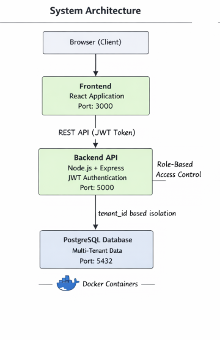

# Multi-Tenant SaaS Platform – Project & Task Management System

## 1. Project Description
A production-ready multi-tenant SaaS application that allows multiple organizations to independently manage users, projects, and tasks with strict tenant data isolation.  
The platform implements role-based access control, subscription limits, JWT authentication, and full Docker-based deployment.

**Target Audience:**  
SaaS platforms, startups, and organizations requiring secure multi-tenant project management.

---

## 2. Features
- Multi-tenant architecture with tenant-level data isolation
- Subdomain-based tenant identification
- JWT-based authentication (24-hour expiry)
- Role-Based Access Control (Super Admin, Tenant Admin, User)
- Subscription plans with enforced limits
- Project and task management
- Task assignment and status tracking
- Audit logging for critical operations
- Fully Dockerized (Database, Backend, Frontend)
- Automatic database migrations and seed data loading

---

## 3. Technology Stack

### Frontend
- React 18
- Axios
- React Router DOM

### Backend
- Node.js 18
- Express.js
- JWT
- bcrypt

### Database
- PostgreSQL 15

### DevOps
- Docker
- Docker Compose

---

## 4. Architecture Overview
The application follows a three-tier architecture:
- React frontend
- Node.js + Express backend API
- PostgreSQL database

All data records (except super_admin) are isolated using tenant_id.

### Architecture Diagram


---

## 5. Installation & Setup

### Prerequisites
- Docker
- Docker Compose

### Run Application
```bash
docker-compose up -d